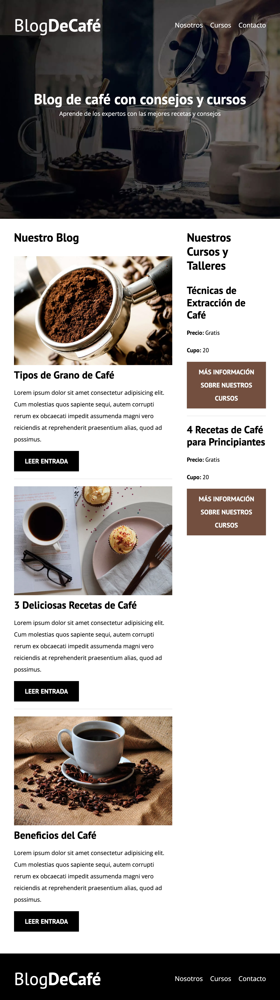
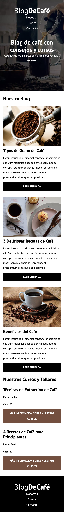

# Sitio Web Blog de Cafe

## Puede ver el sitio Blog de Cafe desplegado en Netlify [Blog de Cafe](https://blog-cafe-jose-david-altamirano.netlify.app/)

## Versión Escritorio

 

## Versión Tablet

 

## Versión Móvil

 

## Tabla de contenido

1. Información general
2. Estado actual
3. Tecnologías utilizadas
4. Instalación y prueba
5. Marcos de competencia
6. Flujo de Trabajo

## Información general

Web estatica Modelo Blog. Consta de:

* Inicio: Página donde se muestran las diferentes entradas del blog.
* Menu de navegación: Nosotros, Cursos, Contacto.
* Nosotros: Página que contiene una imagen y texto adicional.
* Cursos: Página de cursos que incluye imagen del curso, descripción, y cupo.
* Contacto: Página de contacto que incluye un formulario con los campos de nombre, email y mensaje, asi como un boton de enviar.
* Entrada: Página donde se aprecian las diferentes entradas del blog.

## Estado actual

Finalizado.

## Tecnologías utilizadas

* HTML5
* CSS3
* Javascript
* Modernizr
* Mac OS
* Terminal de Mac Os
* Git
* GitHub
* GitKraken
* Netlify
* Visual Studio Code
* Trello

## Instalación y prueba

1. Copia la URL del proyecto
   
```
https://github.com/jdaltamiranodev/blogdecafe_inicio_practica.git
```

2. Abra una terminal, selecione la carpeta donde desea clonar el proyecto, después use el comando git clone y pegue la URL al final dejando un espacio.
3. Finalmente pulse enter. (Tenga en cuenta que debe tener instalado git)

 

```
$ git clone https://github.com/jdaltamiranodev/blogdecafe_inicio_practica.git
```
* Opcional: Puede copiar y pegar la linea anterior en su terminal en la carpeta elegida para clonar el proyecto.

4. Navegue hasta la carpeta clonada, abra el archivo index.html. Presione el botón derecho del ratón y elija la opción "Abrir en navegador predeterminado". Se abrira el navegador en la pagina principal del proyecto y podrá navegar por el mismo.
   
## Marcos de competencia

* HTML5
* CSS3
* Flex Box
* CSS Grid
* Javascript
* Normalize
* Modernizr
* Responsive Design
* Responsively
* Mac OS
* Terminal de Mac OS
* Chrome
* Firefox
* Safari
* Git
* GitHub
* GitKraken
* Netlify
* Visual Studio Code
* Trello

## Flujo de Trabajo

 
